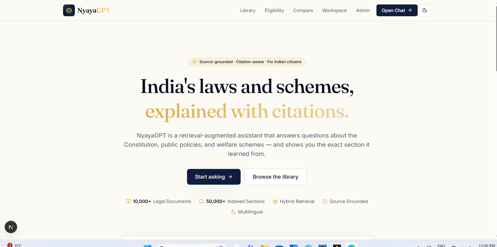
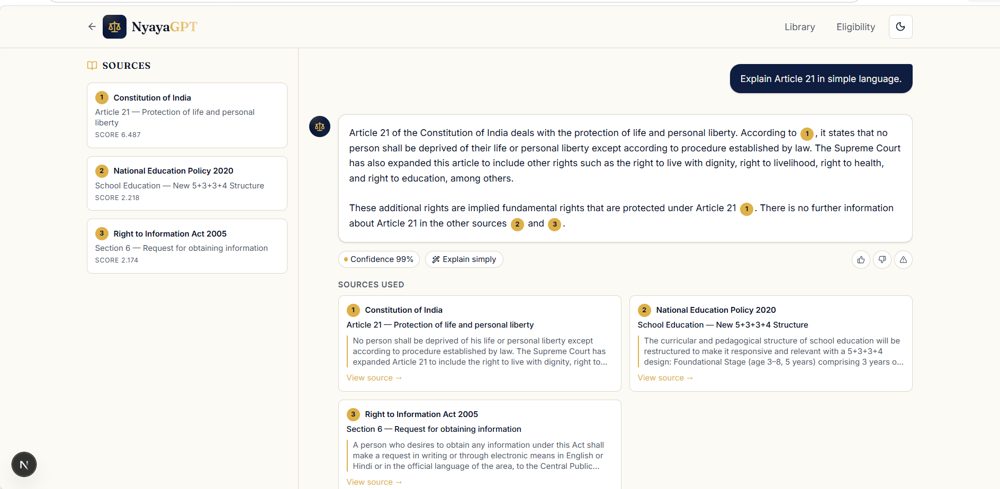
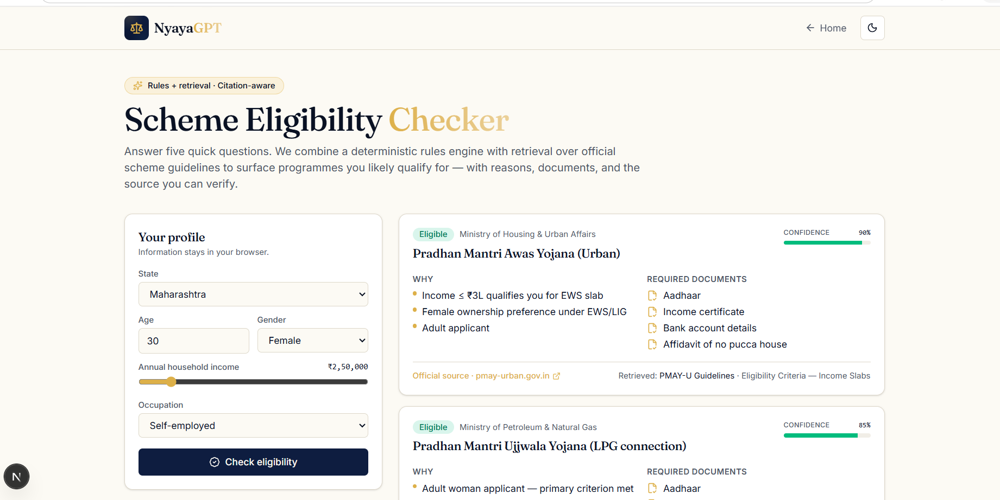

# NyayaGPT — AI-Powered Legal & Civic Intelligence Platform

> India's laws and schemes, explained with citations.

NyayaGPT is a production-grade LegalTech/GovTech SaaS platform that helps Indian citizens understand laws, government policies, constitutional provisions, welfare schemes, and public regulations using **Retrieval-Augmented Generation (RAG)**.

Every answer is source-grounded with citations, allowing users to verify responses through linked legal sections.


## 📸 Screenshots

<div align="center">
  
  <br/>
  <em>NyayaGPT Landing Page</em>
  <br/><br/>
  
  <br/>
  <em>RAG Chat with Citations and Explain Simply</em>
  <br/><br/>
  
  <br/>
  <em>Scheme Eligibility Checker Rules Engine</em>
</div>

## ✨ Key Features

| Feature | Description |
|---------|-------------|
| 🔍 **RAG Chat** | Ask legal questions; get answers with inline [1][2] citations |
| 📚 **Legal Library** | Browse indexed acts, policies, and constitutional articles |
| ✅ **Eligibility Checker** | Check eligibility for 8+ government welfare schemes |
| ⚖️ **Policy Comparison** | Compare two policies side-by-side with export to Markdown |
| 🗣️ **Multilingual** | Ask in English, Hindi, or Punjabi |
| 📝 **Explain Simply** | Transform legal jargon into plain language |
| 📊 **Admin Dashboard** | Live analytics with retrieval latency, feedback, and query metrics |
| 🔐 **Admin Auth** | Cookie-based admin authentication |

## 🏗️ Architecture

```
NyayaGPT/
├── frontend/          # Next.js 15 (App Router) + Tailwind CSS
│   ├── src/app/       # Pages (/, /chat, /library, /eligibility, /compare, /workspace, /admin, /login)
│   ├── src/api/       # API routes (chat, simplify, auth)
│   ├── src/components/# Reusable UI components
│   ├── src/data/      # Seed legal corpus
│   ├── src/lib/       # BM25 retrieval engine
│   └── src/store/     # Zustand state management
├── backend/           # FastAPI + Python 3.12
│   ├── main.py        # API endpoints (chat, simplify, auth)
│   ├── db/schema.sql  # PostgreSQL schema
│   └── requirements.txt
├── docker-compose.yml # Full-stack deployment
└── README.md
```

## 🚀 Quick Start

### Frontend (Next.js)

```bash
cd frontend
npm install
npm run dev
```

Open [http://localhost:3000](http://localhost:3000)

### Backend (FastAPI)

```bash
cd backend
pip install -r requirements.txt
uvicorn main:app --reload
```

Open [http://localhost:8000/docs](http://localhost:8000/docs)

### With Docker

```bash
docker compose up
```

## 🔑 Environment Variables

Create `frontend/.env.local`:

```env
GROQ_API_KEY=your-groq-api-key
ADMIN_USERNAME=admin
ADMIN_PASSWORD=admin123
```

Get your Groq API key from [console.groq.com](https://console.groq.com).

> **Note**: The app works without an API key using intelligent mock responses for demo purposes.

## 🎨 Design Language

- **Style**: Minimalist, premium LegalTech aesthetic
- **Typography**: Fraunces (display) + Inter (body) from Google Fonts
- **Colors**: Deep navy primary (#0F234B), Regal gold accent (#D9B45A), Warm parchment background (#F8F7F3)
- **Dark Mode**: Full dark mode support with OKLCH color system

## 📚 Indexed Legal Corpus

| Document | Year | Sections |
|----------|------|----------|
| Constitution of India | 1950 | Articles 14, 19, 21, 32, 368 |
| RTI Act | 2005 | Sections 4, 6, 7, 8 |
| DPDP Act | 2023 | Sections 6, 9, 11, 33 |
| PMAY-U Guidelines | 2015 | Eligibility, Components |
| MGNREGA | 2005 | Sections 3, Schedule I, Section 17 |
| NEP 2020 | 2020 | 5+3+3+4 Structure, Higher Ed, Technology |
| Ayushman Bharat | 2018 | Coverage, Eligibility |

## 🛠️ Tech Stack

| Layer | Technology |
|-------|-----------|
| Frontend | Next.js 15, TypeScript, Tailwind CSS |
| Animations | Framer Motion |
| State | Zustand |
| Charts | Recharts |
| Icons | Lucide React |
| Backend | FastAPI, Python 3.12 |
| AI/LLM | Groq (Llama-3.3-70b) |
| Retrieval | BM25 (built-in), Qdrant (vector DB) |
| Database | PostgreSQL |
| Deployment | Vercel (frontend), Railway (backend) |
| Containers | Docker, Docker Compose |

## 📄 License

This project is for educational and informational purposes. Not legal advice.

---

Built with ❤️ for Indian citizens · Powered by Retrieval-Augmented Generation
